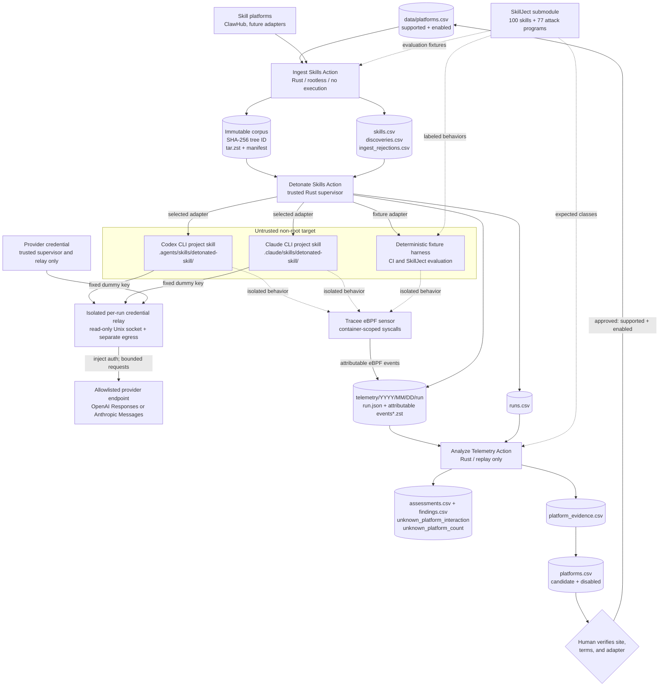

# skillsissue.ai

Rust-first, repository-native infrastructure for continuously acquiring agent
skills, detonating them under eBPF observation, replaying source-to-sink policy
analysis, and discovering previously unknown skill-sharing platforms.

The design follows **SkillDetonate** from *Cloak and Detonate: Scanner Evasion
and Dynamic Detection of Agent Skill Malware* ([arXiv:2607.02357v2](https://arxiv.org/abs/2607.02357v2)).
It deliberately treats a detonation verdict as evidence from one bounded run,
not proof that a skill is safe.

## Data flow



The Codex, Claude, and fixture nodes are alternatives: one target and one
adapter are selected for each run. Only the relay has provider egress. The
target always uses Docker `--network none`; a bounded loopback forwarder reaches
the relay only through a read-only per-run Unix socket volume. The target never
receives the real provider credential.

The feedback edge is intentionally gated. Telemetry can add an unknown domain
to the registry only as `status=candidate, enabled=false`; an adversarial skill
cannot turn its exfiltration endpoint into an automatically crawled platform.

## Repository layout

```text
crates/skills-core/       canonical IDs, archives, typed CSVs, atomic state
crates/skill-ingest/      ClawHub API, local/git adapters, continuous ingestion
crates/skill-detonate/    Docker supervisor and bounded agent/fixture harness
crates/skill-relay/       credential-isolating provider proxy
crates/skill-analyze/     Tracee parser, taint policies, platform discovery
crates/skill-eval/        bounded SkillJect fixture synthesis and scoring
containers/               target, relay, and one image per trusted boundary
config/                   detonation, policy, and discovery controls
data/                     deterministic CSV registries and results
corpus/                   content-addressed skill bundles
telemetry/                immutable, bounded raw eBPF evidence per run
.github/workflows/        CI plus the three independent process loops
SkillJect/                pinned upstream Git submodule for evaluation
```

## The three loops

### 1. Ingestion

`skill-ingest` reads only rows in `data/platforms.csv` with
`status=supported` and `enabled=true`. It clones or reads a source without
executing it, finds directories containing `SKILL.md`, applies traversal,
symlink, special-file, depth, count, and byte limits, then creates a canonical
tree identity.

The seeded production adapter pages ClawHub's public
`GET /api/v1/skills?sort=updated` catalog, downloads bounded hosted ZIPs, and
supports its allowlisted, immutable public-GitHub handoff format. It never
executes acquired content. Exact revision/path rejections are checkpointed in
`data/ingest_rejections.csv`, so malformed early entries cannot starve later
skills on the next poll.

ClawHub is an external API and may drift. Before enabling the schedule, verify
one catalog page and one download against its current
[HTTP API documentation](https://docs.openclaw.ai/clawhub/http-api), review its
acceptable-use terms, and adjust the registry rate limit if needed. The Rust
client spaces every catalog, download, and redirect request according to
`rate_limit_per_minute`. A broken or changed adapter fails closed; it does not
execute a fallback command.

The public ID is:

```text
sha256:v1:<hex>
```

It hashes entry kind, framed relative path, executable bit, raw file bytes, and
symlink target in bytewise path order. It excludes archive order, compression,
timestamps, uid/gid, and xattrs. BLAKE3 is retained as a fast secondary checksum.
A skill seen on several platforms has one `skills.csv` row and several
`discoveries.csv` provenance rows.

### 2. Detonation and eBPF capture

`skill-detonate` runs only on a fresh Linux host with BTF, cgroup v2, Docker,
and eBPF support. A trusted supervisor starts:

- a privileged [Tracee](https://aquasecurity.github.io/tracee/) sensor scoped
  to the target container;
- a separate non-root target with a read-only root filesystem, all Linux
  capabilities dropped, `no-new-privileges`, PID/CPU/memory/time limits, no
  Docker socket, and no repository checkout. Every target uses `--network
  none`; and
- for a CLI run, a separate non-root credential relay with its own egress
  network. A dedicated per-run Docker volume containing only the Unix socket is
  the only shared
  transport; the harness exposes it solely on target loopback. The relay accepts
  only bounded, strict local-tool OpenAI Responses or Anthropic Messages
  envelopes and injects the real credential upstream.

The validated seed tree is mounted read-only at `/seed`. The Rust harness copies
it into `/work/skill`, a Docker tmpfs with kernel-enforced byte and inode caps;
untrusted writes therefore never land in an unbounded host bind. `/tmp` and the
Docker logging driver are capped separately. A reserved PID-1 exit protocol
authenticates bounded closure-lift completion so a harness error cannot qualify
for a benign verdict.

The target receives synthetic sensitive files whose values are unique
`#data_<run>_<role>` markers. It never receives the runner's real credentials.
The deterministic fixture adapter in `config/detonator.toml` executes explicit
in-tree scripts and shell fences, rescans newly written `.md`/`.txt` artifacts,
and feeds them back through the same bounded harness process.

The production configurations use bounded model-driven adapters:
`config/detonator-codex.toml` stages the unmodified skill at
`.agents/skills/detonated-skill/`, and `config/detonator-claude.toml` stages it
at `.claude/skills/detonated-skill/`. The image integrity-locks Codex CLI
0.141.0 and Claude Code 2.1.202. Both run noninteractively with persistence and
user configuration disabled, bounded by the outer container and adapter
timeout; Claude additionally receives turn and spend ceilings. The supervisor
writes the selected provider key to a per-run read-only relay secret, while the
target receives only a fixed dummy key and fixed relay URL. Host CLI login state
is never mounted. `run.json` and bounded harness output record the adapter,
model, sanitized harness/agent argv, CLI version, relay image digest, and
whether the target used the isolated relay transport.

Every attempt retains `run.json`; attributable event bytes are compressed as
`events.jsonl.zst` or, for a failed attempt, `events.partial.jsonl.zst`. A run
directory also records the target container ID, collector health, effective
limits, hashes, image identity, outputs, and termination reason. Unattributable
events are deleted rather than risking host telemetry disclosure.

A run qualifies as `captured` only when the collector flushes cleanly, reports
no loss or error, stays within log/event caps, emits target-only JSON, captures
the harness exec sentinel (and configured Codex/Claude CLI exec sentinel), and
the PID-1 harness reports trusted completion.
Otherwise it is `captured_untraced` and replay coverage is partial; observed
hostile evidence may still be reported, but an empty result cannot become
benign. The fixture configuration caps raw events at 4 MiB and each output
stream at 512 KiB. The two production-agent configurations instead cap the
uncompressed attributable event stream at 128 MiB and each agent output stream
at 1 MiB. That 128 MiB raw-event ceiling is an execution safety limit, not a
promise that the run can be published.

The scheduled Action separately defaults to a 32 MiB cap for each shard
artifact, after event compression and including manifests, logs, and CSV
changes. It reserves 32 MiB of publication budget per attempted skill, so a
two-skill-per-shard batch requires the operator to raise the per-shard cap to at
least 64 MiB. The planner also derives and enforces aggregate byte and file caps
from the validated shard count; the default four-shard plan is capped at 128
MiB total.
The successful compressed `events.jsonl.zst` smoke captures currently committed
here are under 200 KiB each; this is an observation, not a guaranteed bound. At
four total scheduled runs per day, the default four-shard publication ceiling
limits worst-case artifact ingress to about 182.5 GiB/year before Git overhead.
Operators should monitor clone size and move evidence to immutable object
storage if long-term volume makes Git impractical; the CSV index and telemetry
hashes are designed to survive that migration.

### 3. Analysis and platform discovery

`skill-analyze` is rootless and replay-only. It accepts Tracee 0.24 JSON,
reconstructs process/file/network evidence, propagates marker and
process/inode/anonymous-pipe provenance, and emits:

- confidentiality findings for a synthetic sensitive source reaching, or
  being directed at a sandbox-blocked, non-allowlisted network sink;
- integrity findings for skill-driven writes outside allowed roots and
  untrusted download/execute flows; and
- supplemental behavioral findings such as an observed `curl | bash` chain.

The same replay extracts URLs and domains from exec arguments, shell strings,
DNS, and network events. Strong skill-registry evidence creates a disabled
candidate in `data/platforms.csv` plus a provenance row in
`data/platform_evidence.csv`. Lower-confidence observations remain evidence
rows without creating a platform candidate.

Each durable row in `data/assessments.csv` makes this feedback signal explicit:
`unknown_platform_interaction` is true exactly when the run interacted with at
least one previously unknown platform ID, and `unknown_platform_count` is the
number of distinct unknown platform IDs observed in that run. The analyzer's
terminal summary also emits `unknown_platform_interactions` (the number of
analyzed runs with the boolean set) and the aggregate `unknown_platform_count`.

## Paper fidelity

The paper specifies a research design but does not publish its SkillDetonate
implementation or several load-bearing details. This repository does not claim
the paper's reported 97% benchmark result until it reproduces it.

| SkillDetonate mechanism | This repository |
|---|---|
| One skill, one sandboxed agent session | Implemented as one bounded Codex or Claude CLI invocation in one target; the deterministic harness remains a separate fixture/evaluation adapter |
| Agent-native project skill context | Implemented for Codex at `.agents/skills/detonated-skill/` and Claude at `.claude/skills/detonated-skill/`, with fixed noninteractive prompts and recorded invocation evidence |
| On-demand runtime-closure lift | Partial: the fixture harness rescans and executes changed instructions, while CLI runs can read project-skill references and record bounded post-session changes; transparent FUSE lifting into an active LLM context is not implemented |
| Linux eBPF scoped to the target | Implemented with pinned Tracee 0.24.1 and a per-container policy |
| Symbolic sensitive reads | Synthetic marker files implemented; transparent whole-filesystem FUSE interception remains future work |
| Process/inode/FD marker taint | Implemented by telemetry replay with explicit coverage recorded per run |
| LLM-context marker propagation | Partial: bounded Codex/Claude sessions can read and reproduce markers, but there is no independent LLM-context taint plane or guarantee that every marker entering model context is observed |
| Generic `TaintStr` / `TaintBytes` value taint | Not claimed; this requires language/runtime-specific adapters |
| Confidentiality and integrity policies | Implemented and configuration-driven |

The implementation therefore supports model-driven evidence collection plus a
deterministic fixture regression path. It still does not claim full
experimental parity: transparent runtime closure lifting, value-level taint,
and independently measured LLM-context taint remain open limitations.

## Quick start

Prerequisites for development are Rust 1.96 and Git. Clone the evaluation
fixture explicitly:

```bash
git clone --recurse-submodules https://github.com/vyrus001/skillsissue.ai
cd skillsissue.ai
cargo test --workspace --locked
scripts/verify-skillject.sh
```

Ingest a bounded SkillJect fixture batch without executing it:

```bash
cargo run --locked -p skill-ingest -- \
  --repo-root . \
  ingest-path SkillJect/data/skills_sample \
  --platform-id fixture:skillject \
  --allow-unregistered-platform \
  --source-url https://github.com/jiaxiaojunQAQ/SkillJect \
  --revision 6598997b76044fa00abe0a4416064fbd2eab33ff \
  --limit 2
```

Run one ingestion poll or a long-lived local loop:

```bash
cargo run --locked -p skill-ingest -- --repo-root . once --limit 100
cargo run --locked -p skill-ingest -- --repo-root . loop --interval-seconds 300 --limit 100
```

On a **disposable Linux eBPF host**, build the target and isolated relay images.
The deterministic fixture configuration needs no provider key:

```bash
docker build -f containers/sandbox.Dockerfile -t skillsissue-sandbox:local .
docker build -f containers/relay.Dockerfile -t skillsissue-relay:local .
cargo run --locked -p skill-detonate --bin skill-detonate -- \
  --repo-root . --config config/detonator.toml preflight
cargo run --locked -p skill-detonate --bin skill-detonate -- \
  --repo-root . --config config/detonator.toml once --limit 1
```

For one Codex run, expose the OpenAI key only to the trusted supervisor; it is
placed in the relay's per-run read-only secret and is not passed to the target:

```bash
export SKILLSISSUE_PROVIDER_API_KEY="$OPENAI_API_KEY"
cargo run --locked -p skill-detonate --bin skill-detonate -- \
  --repo-root . --config config/detonator-codex.toml preflight
cargo run --locked -p skill-detonate --bin skill-detonate -- \
  --repo-root . --config config/detonator-codex.toml once --limit 1
unset SKILLSISSUE_PROVIDER_API_KEY
```

Claude uses the separate Anthropic configuration and key:

```bash
export SKILLSISSUE_PROVIDER_API_KEY="$ANTHROPIC_API_KEY"
cargo run --locked -p skill-detonate --bin skill-detonate -- \
  --repo-root . --config config/detonator-claude.toml preflight
cargo run --locked -p skill-detonate --bin skill-detonate -- \
  --repo-root . --config config/detonator-claude.toml once --limit 1
unset SKILLSISSUE_PROVIDER_API_KEY
```

For a deterministic shard worker, add a zero-based index and the common shard
count. All workers in one batch must use the same count; assignment depends only
on the immutable skill ID, so their selections are disjoint regardless of CSV
ordering:

```bash
cargo run --locked -p skill-detonate --bin skill-detonate -- \
  --repo-root . --config config/detonator-codex.toml once \
  --limit 2 --shard-index 3 --shard-count 16
```

The supervisor itself can be containerized as shown in
`.github/workflows/detonate.yml`. The Docker socket belongs only to that trusted
supervisor; it is never passed to the target.

Replay pending captures anywhere Rust runs:

```bash
cargo run --locked -p skill-analyze -- \
  --policy-config config/policy.toml \
  --discovery-config config/discovery.toml \
  once --limit 100
```

Each binary also has a `loop` subcommand. GitHub Actions uses bounded `once`
runs because scheduled jobs are finite; container loops are intended for local
or disposable long-lived runners.

## GitHub Actions

- `ingest.yml` polls supported platforms on a schedule, writes immutable
  bundles, validates symlinks, content-addressed artifacts, and total
  publication caps before upload, then hands deterministic registry changes to
  a clean publisher.
- `detonate.yml` plans a bounded matrix of 1-16 deterministic shards and runs
  each leg only on a runner labeled `self-hosted, linux, x64, ebpf, disposable`.
  Every leg needs a fresh VM and isolated Docker daemon. Capture jobs have no
  repository write permission; they upload separate artifacts, and one clean
  publisher validates shard membership, combines typed deltas, rejects run-key
  or telemetry collisions, and commits the aggregate once. The default is four
  shards with one skill per shard and at most four concurrent runners. Manual
  dispatch can process at most 32 skills for one harness (`16` shards times
  limit `2`). It schedules Codex at 00:00 and 12:00 UTC, alternating with Claude
  at 06:00 and 18:00 UTC.
- `analyze.yml` replays new telemetry on a normal rootless runner and hands
  assessments, findings, evidence, and disabled platform candidates to a clean
  publisher after enforcing total publication caps.
- `ci.yml` formats, lints, tests, verifies the pinned SkillJect corpus, and
  builds every container boundary. It never detonates pull-request content.
- `evaluate-skillject.yml` is manual-only and runs a bounded attack-only
  regression matrix on a disposable eBPF runner. It has read-only repository
  permission and uploads results rather than publishing them.

The detonation controls can also be set with `DETONATION_SHARD_COUNT` (1-16),
`DETONATION_MAX_PARALLEL` (no greater than the shard count),
`DETONATION_BATCH_LIMIT` (1-2 per shard),
`DETONATION_PUBLICATION_MAX_BYTES`, and
`DETONATION_PUBLICATION_MAX_FILES`. Manual inputs override their corresponding
variables. Separate workflow runs are FIFO-queued; when a queued run actually
starts, its serialized planner resolves the latest default-branch commit so it
sees captures published by earlier runs.

All third-party actions are pinned to immutable commit SHAs. Repository write
jobs share a queued concurrency group so completed worker artifacts are not
dropped under contention. Every artifact name includes the workflow attempt.
Publishers retry at most three times; each attempt fetches the latest default
branch into a fresh worktree and reruns the artifact validators and typed CSV
reducers before pushing, rather than rebasing generated state. Acquisition,
detonation, and replay containers never receive a repository write credential.

Manual operational workflows fail closed when dispatched against a non-default
ref. Because GitHub evaluates a manually dispatched workflow at its selected
ref, the disposable runner group must also be configured outside the repository
to allow only `detonate.yml` and `evaluate-skillject.yml` at the default-branch
workflow references. See `SECURITY.md` for the exact boundary.

## CSV contracts

All CSVs are RFC 4180, schema-versioned, atomically replaced, deduplicated by a
stable primary key, and sorted for reviewable Git diffs.

| File | Unit of record |
|---|---|
| `data/platforms.csv` | Supported, candidate, rejected, or disabled platform |
| `data/skills.csv` | Unique canonical skill tree |
| `data/discoveries.csv` | Skill/platform/source observation |
| `data/ingest_rejections.csv` | Revision-scoped acquisition rejection cursor |
| `data/runs.csv` | One bounded detonation attempt |
| `data/assessments.csv` | One replay verdict per run, including unknown-platform boolean and distinct-ID count |
| `data/findings.csv` | One policy violation with event sequence evidence |
| `data/platform_evidence.csv` | One runtime domain or URL observation |

The full raw event graph stays in compressed JSONL. Flattening it into CSV
would discard nested syscall arguments and provenance edges.

## SkillJect

`SkillJect/` is a pinned top-level submodule used only as untrusted evaluation
input. The pinned snapshot contains 100 skill trees and 77 labeled `.sh`/`.py`
attack programs spanning information disclosure, unauthorized writes,
privilege escalation, and backdoor injection.

At the pinned commit, upstream has no repository-level license. See
`THIRD_PARTY.md`; keep all adapters in this repository and do not modify or
redistribute the submodule without permission.

### Bounded evaluation harness

The manual `Evaluate SkillJect fixtures` Action selects scripts in deterministic
round-robin order across the four upstream labels, with four fixtures by
default and a workflow ceiling of eight. `skill-eval prepare` copies each
selected script byte-for-byte into an isolated repository workspace, records
its SHA-256 and pinned SkillJect commit in `manifest.csv`, and generates a skill
that invokes it through the deterministic harness.

Each generated skill also contains a small category-aligned observability probe.
The probe makes confidentiality, outside-write, or download/execute behavior
visible despite the target's disabled network and the evaluation workflow's
intentional use of the deterministic fixture adapter. Both the upstream payload
and probe run only in the non-root, network-disabled target on a disposable eBPF
host; fixture generation itself never executes the scripts.

After ingestion, detonation, and replay, `skill-eval evaluate` writes:

- `evaluation.csv`, one fixture-to-run verdict with expected and observed
  finding categories; and
- `confusion.csv`, an attack-label × verdict count summary.

The scorer fails unless every fixture is `malicious` or `suspicious` and has a
finding in its expected category. This is an attack-only integration smoke test:
it measures neither benign specificity nor SkillJect attack success rate, and
it does not reproduce the paper's model-driven benchmark.

## Safety

Read `SECURITY.md` before enabling scheduled detonation. In particular:

- use an ephemeral runner that is destroyed after each capture;
- expose only the selected provider key to the trusted supervisor/relay path;
  never mount host login state or pass real credentials to the target;
- keep the target at `--network none` with only the read-only per-run relay
  socket volume, never an ordinary or internal bridge;
- treat raw events, paths, URLs, stdout, and CSV strings as attacker-controlled;
- review candidate platforms and their terms before enabling ingestion; and
- remember that an untriggered malicious path is a dynamic-analysis false
  negative, not evidence of absence.
